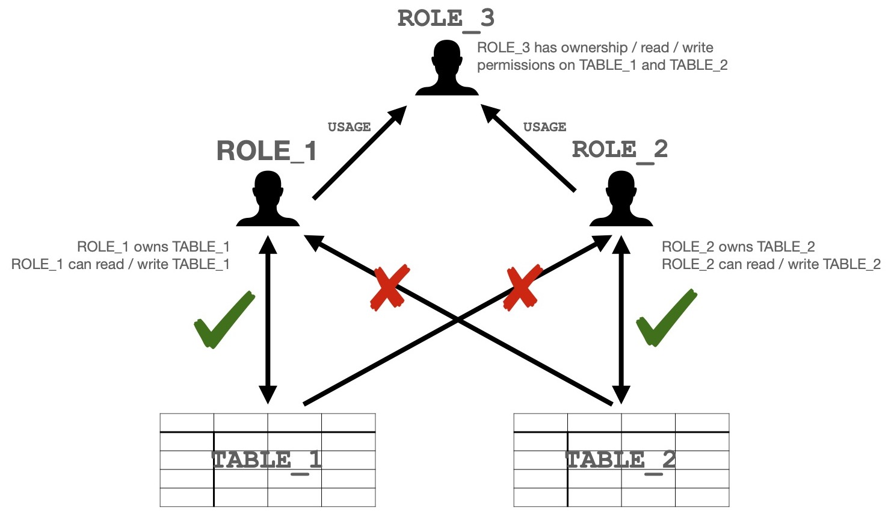
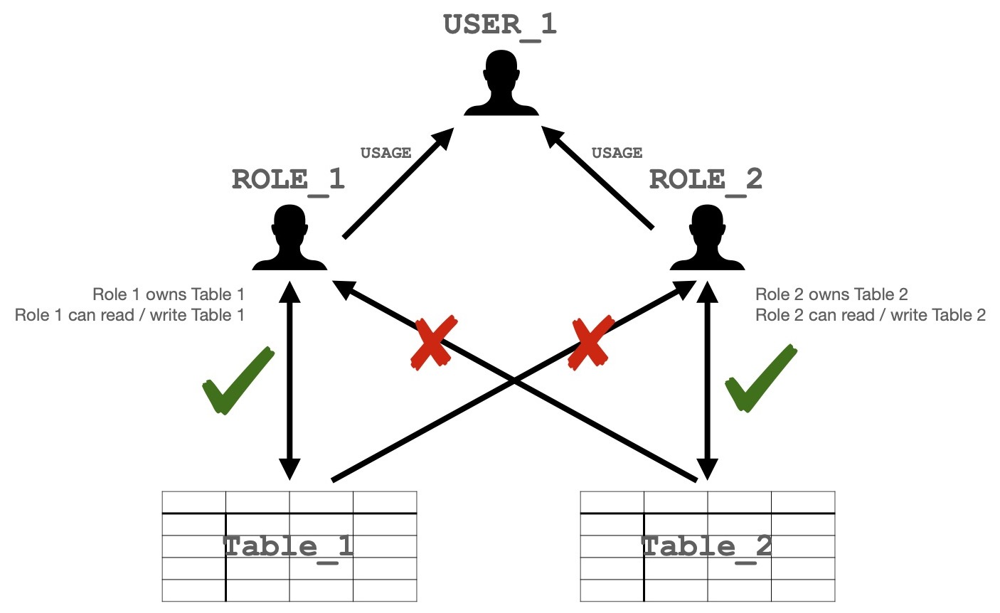

# Snowflake Playground

Terraform module for creating a 'Playground' environment within a Snowflake account. For users, a Playground environment in Snowflake is a place where they know that they have write permissions, and are free to create and play without worry regarding permissions. For Administrators, it is an environment that they know will self-clean and don't need to manually manage.

## Why should I create a Playground environment?

If you experience any of the following in your Snowflake account, then a Playground environment may be useful:

- Users creating objects for development, but then forgetting to delete them.
  - You're then left with a schema with tens, hundreds, thousands of objects that you don't know what they are for. Is it safe to delete them, or are they something important? Maybe the person who created the object has left so you can't even ask them any more.
- Users deploying Production systems to development environments - the continual clean-up of the Playground environment will discourage the deployment of production systems in the Playground.
- Users (especially new users) not knowing where to create objects, because they aren't sure where they have permissions.

Solving these issues manually can be incredibly time consuming and wasteful. A Playground area is a one-stop-shop to help resolve these issues, and give users a clear and safe space to experiment.

## Disclaimer

> Use of this Terraform Module is done at your own risk. The authors have made their best efforts to ensure that it works as intended. You should test the playground before implementation to ensure that it works as you desire. The authors are not responsible for any loss of data that may occur as a result of your use or deployment of this module.

## Requirements

- Snowflake Enterprise Edition Account (or above)
  - The module requires object tagging, which is only available in Enterprise edition accounts (and above).

## Usage

```HCL
module "playground" {
    source  = "jagoodhand/playground/snowflake"
}
```

By default this will use your configured Snowflake provider to deploy a Playground into your Snowflake account with the configuration:

- Playground Schema: `PLAY.GROUND`
- Administration Schema: `PLAY.ADMINISTRATION`
- Expiry Date Tag: `PLAY.ADMINISTRATION.EXPIRY_DATE`
- Playground Warehouse: `PLAYGROUND_ADMIN_WAREHOUSE`
  - Size: `X-SMALL`
- TimeTravel for the Playground schema: `1 day`
- Standard max object age: `31`
- Max allowed expiry-date tag: `90 days in future`
- Automation schedule (disabled by default): `"USING CRON 0 3 * * * UTC"`

For safety, the playground automation is disabled by default. Set the following inputs to enable the automation:

```HCL
module "playground" {
    source  = "jagoodhand/playground/snowflake"

    dry_run = false
    tasks_enabled = true
}
```

## Playground Automation Logic

The Playground Automation (once enabled) ensures that the Playground doesn't become a dumping ground for all data, and discourages the building of production systems within the Playground.

> :information_source: **Note:** The automation will not stop someone from deploying a production system to the Playground if they were willing to continually update their tags.


**Rule 1:** Any untagged object will be dropped after the number of days specified by the `max_object_age_without_tag` variable.

**Rule 2:** Any object tagged with the `EXPIRY_DATE` tag, where the `EXPIRY_DATE` of the tag has passed, will be dropped.

**Rule 3:** Any `EXPIRY_DATE` tag, with a value greater than the number of days in the future specified by the `max_expiry_days` variable, will have their `EXPIRY_DATE` tag altered to be `max_expiry_days` in the future.

### Examples

The examples below describe the expected behaviour of the automation in each scenario.

> For these examples, we will assume that:
>
> - The current date is 2023-01-01
> - `max_object_age_without_tag` = 30
> - `max_expiry_days` = 60

| **Table Name** | **Created Date** | **Expiry Date Value** | **Expected Behaviour**                               |
|----------------|------------------|-----------------------|------------------------------------------------------|
| TABLE_1        | 2022-11-01       | null                  | Drop TABLE_1                                         |
| TABLE_2        | 2022-11-01       | 2023-01-31            | Do nothing                                           |
| TABLE_3        | 2022-11-01       | 2023-06-01            | Alter Expiry Date tag for TABLE_3 to be `2023-02-02` |
| TABLE_4        | 2022-12-20       | null                  | Do nothing                                           |

## Security / Permissions

This Playground primarily relies on Snowflake [Managed Access Schemas](https://docs.snowflake.com/en/user-guide/security-access-control-configure#creating-managed-access-schemas). Using Managed Access Schemas means that the users who created the object, are not able to control the grants on that object. In the Playground, only the `ACCOUNTADMIN` role is able to control the grants on objects.

> :information_source: **Note:** Even though an `ACCOUNTADMIN` can manual grant permissions on objects in the Playground, they *should not*. If users are requesting manual grants, then they are likely abusing the purpose of the Playground environment.

**Principles:**

- Objects created in the Playground are only usable by the role that created them (or another role that inherits the creating role).
- Additional grants in the Playground **must not** be created. If users need to share data between themselves or roles, the Playground is _not_ the place to do it.

The operation of these principles is illustrated in _Diagram 1_.


*Diagram 1 - Illustration of object access control within the Playground.*

`ROLE_1` cannot 'see', or operate on `TABLE_2`, and `ROLE_2` cannot 'see' or operate on `TABLE_1`.

`ROLE_1` / `ROLE_2` can only know about the existence of `TABLE_2` / `TABLE_1` through the `SNOWFLAKE.ACCOUNT_USAGE` information, or by attempting to create a table of the same name at which time an error will occur.

> :exclamation: **WARNING**: Snowflake Secondary Roles can enable users to move data in unexpected ways. This is described below. You should be aware of this before deploying the Playground to your Snowflake account.

### Snowflake Secondary Role Implications

Snowflake have introduced the concept of [Secondary Roles](https://docs.snowflake.com/en/user-guide/security-access-control-overview#enforcement-model-the-primary-role-and-secondary-roles).

<!-- 
*Diagram 2 - Illustration of how Secondary Roles effect table access.* -->

Prior to Secondary Roles, even if `USER_1` had access to `ROLE_1` and `ROLE_2`, they would not be able to read data from `ROLE_2`, and write it so that `ROLE_1` then had access to it i.e. it wouldn’t be possible to do:

```sql
USE ROLE1;
CREATE TABLE_1 AS SELECT * FROM TABLE_2;
```

With Secondary Roles, **this is now possible**. This isn’t an issue unique to the Snowflake Playground. It can occur anywhere in your Snowflake account, but it is something to be aware of. A user could use this as a method of exposing sensitive data to other users who did not have permission to initially read it. You should therefore assume that any user can make data that they can read available to any other user whom they share a role with write permissions with.

## Limitations

- Tagging information utilised by the module may be up to 3 hours out of date. This is because it is only currently possible to bulk-source tag references in Snowflake from the `SNOWFLAKE.ACCOUNT_USAGE` schema. Thus it is recommended that the automation is only run once daily, and at least 3 hours after midnight to account for the delay.
- Two users cannot create an object of the same name within the Playground.

### Object Types

The logic within the Playground Automation will operate on the following Snowflake object types:

- Tables
- External Tables
- Views
- Materialized Views
- Pipes
- Procedures
- Stages
- Streams
- Tasks

The logic will not operate on the following Snowflake object types, because they cannot be tagged:

- Tags
- File Formats
- Functions
- Masking Policies
- Row Access Policies
- Sequences

Some of the logic in this module treats tables, external tables views, and materialized views as the same because these objects cannot share the same name.

## Contributing

Report issues/questions/feature requests on in the [issues](https://github.com/jagoodhand/terraform-snowflake-playground/issues/new) section.

Full contributing [guidelines are covered here](.github/contributing.md).

## License

Apache 2 Licensed. See [LICENSE](https://github.com/jagoodhand/terraform-snowflake-playground/blob/main/LICENSE) for full details.

## Authors

Module is maintained by [James Goodhand](https://github.com/jagoodhand).

<!-- BEGINNING OF PRE-COMMIT-TERRAFORM DOCS HOOK -->
## Requirements

| Name | Version |
|------|---------|
| <a name="requirement_terraform"></a> [terraform](#requirement\_terraform) | >= 1.1.7 |
| <a name="requirement_snowflake"></a> [snowflake](#requirement\_snowflake) | 0.54.0 |

## Providers

| Name | Version |
|------|---------|
| <a name="provider_snowflake"></a> [snowflake](#provider\_snowflake) | 0.54.0 |

## Modules

No modules.

## Resources

| Name | Type |
|------|------|
| [snowflake_database.play](https://registry.terraform.io/providers/Snowflake-Labs/snowflake/0.54.0/docs/resources/database) | resource |
| [snowflake_database_grant.play_usage](https://registry.terraform.io/providers/Snowflake-Labs/snowflake/0.54.0/docs/resources/database_grant) | resource |
| [snowflake_function.normalize_proc_names](https://registry.terraform.io/providers/Snowflake-Labs/snowflake/0.54.0/docs/resources/function) | resource |
| [snowflake_object_parameter.log_table_data_retention](https://registry.terraform.io/providers/Snowflake-Labs/snowflake/0.54.0/docs/resources/object_parameter) | resource |
| [snowflake_procedure.tidy_playground](https://registry.terraform.io/providers/Snowflake-Labs/snowflake/0.54.0/docs/resources/procedure) | resource |
| [snowflake_procedure.update_objects](https://registry.terraform.io/providers/Snowflake-Labs/snowflake/0.54.0/docs/resources/procedure) | resource |
| [snowflake_schema.administration](https://registry.terraform.io/providers/Snowflake-Labs/snowflake/0.54.0/docs/resources/schema) | resource |
| [snowflake_schema.ground](https://registry.terraform.io/providers/Snowflake-Labs/snowflake/0.54.0/docs/resources/schema) | resource |
| [snowflake_schema_grant.play_administration_grant_usage](https://registry.terraform.io/providers/Snowflake-Labs/snowflake/0.54.0/docs/resources/schema_grant) | resource |
| [snowflake_schema_grant.play_ground_grant_external_table](https://registry.terraform.io/providers/Snowflake-Labs/snowflake/0.54.0/docs/resources/schema_grant) | resource |
| [snowflake_schema_grant.play_ground_grant_file_format](https://registry.terraform.io/providers/Snowflake-Labs/snowflake/0.54.0/docs/resources/schema_grant) | resource |
| [snowflake_schema_grant.play_ground_grant_function](https://registry.terraform.io/providers/Snowflake-Labs/snowflake/0.54.0/docs/resources/schema_grant) | resource |
| [snowflake_schema_grant.play_ground_grant_masking_policy](https://registry.terraform.io/providers/Snowflake-Labs/snowflake/0.54.0/docs/resources/schema_grant) | resource |
| [snowflake_schema_grant.play_ground_grant_materialized_view](https://registry.terraform.io/providers/Snowflake-Labs/snowflake/0.54.0/docs/resources/schema_grant) | resource |
| [snowflake_schema_grant.play_ground_grant_pipe](https://registry.terraform.io/providers/Snowflake-Labs/snowflake/0.54.0/docs/resources/schema_grant) | resource |
| [snowflake_schema_grant.play_ground_grant_procedure](https://registry.terraform.io/providers/Snowflake-Labs/snowflake/0.54.0/docs/resources/schema_grant) | resource |
| [snowflake_schema_grant.play_ground_grant_row_policy](https://registry.terraform.io/providers/Snowflake-Labs/snowflake/0.54.0/docs/resources/schema_grant) | resource |
| [snowflake_schema_grant.play_ground_grant_sequence](https://registry.terraform.io/providers/Snowflake-Labs/snowflake/0.54.0/docs/resources/schema_grant) | resource |
| [snowflake_schema_grant.play_ground_grant_stage](https://registry.terraform.io/providers/Snowflake-Labs/snowflake/0.54.0/docs/resources/schema_grant) | resource |
| [snowflake_schema_grant.play_ground_grant_stream](https://registry.terraform.io/providers/Snowflake-Labs/snowflake/0.54.0/docs/resources/schema_grant) | resource |
| [snowflake_schema_grant.play_ground_grant_table](https://registry.terraform.io/providers/Snowflake-Labs/snowflake/0.54.0/docs/resources/schema_grant) | resource |
| [snowflake_schema_grant.play_ground_grant_task](https://registry.terraform.io/providers/Snowflake-Labs/snowflake/0.54.0/docs/resources/schema_grant) | resource |
| [snowflake_schema_grant.play_ground_grant_temporary_table](https://registry.terraform.io/providers/Snowflake-Labs/snowflake/0.54.0/docs/resources/schema_grant) | resource |
| [snowflake_schema_grant.play_ground_grant_usage](https://registry.terraform.io/providers/Snowflake-Labs/snowflake/0.54.0/docs/resources/schema_grant) | resource |
| [snowflake_schema_grant.play_ground_grant_view](https://registry.terraform.io/providers/Snowflake-Labs/snowflake/0.54.0/docs/resources/schema_grant) | resource |
| [snowflake_table.log_table](https://registry.terraform.io/providers/Snowflake-Labs/snowflake/0.54.0/docs/resources/table) | resource |
| [snowflake_table.streams](https://registry.terraform.io/providers/Snowflake-Labs/snowflake/0.54.0/docs/resources/table) | resource |
| [snowflake_table.tasks](https://registry.terraform.io/providers/Snowflake-Labs/snowflake/0.54.0/docs/resources/table) | resource |
| [snowflake_tag.expiry_date_tag](https://registry.terraform.io/providers/Snowflake-Labs/snowflake/0.54.0/docs/resources/tag) | resource |
| [snowflake_tag_grant.expiry_date_apply_grant](https://registry.terraform.io/providers/Snowflake-Labs/snowflake/0.54.0/docs/resources/tag_grant) | resource |
| [snowflake_task.tidy](https://registry.terraform.io/providers/Snowflake-Labs/snowflake/0.54.0/docs/resources/task) | resource |
| [snowflake_task.update_stream_objects](https://registry.terraform.io/providers/Snowflake-Labs/snowflake/0.54.0/docs/resources/task) | resource |
| [snowflake_task.update_task_objects](https://registry.terraform.io/providers/Snowflake-Labs/snowflake/0.54.0/docs/resources/task) | resource |
| [snowflake_view.log_summary](https://registry.terraform.io/providers/Snowflake-Labs/snowflake/0.54.0/docs/resources/view) | resource |
| [snowflake_view.log_view](https://registry.terraform.io/providers/Snowflake-Labs/snowflake/0.54.0/docs/resources/view) | resource |
| [snowflake_view.object_ages](https://registry.terraform.io/providers/Snowflake-Labs/snowflake/0.54.0/docs/resources/view) | resource |
| [snowflake_view.object_tags](https://registry.terraform.io/providers/Snowflake-Labs/snowflake/0.54.0/docs/resources/view) | resource |
| [snowflake_view_grant.select_object_ages_grant](https://registry.terraform.io/providers/Snowflake-Labs/snowflake/0.54.0/docs/resources/view_grant) | resource |
| [snowflake_view_grant.select_object_tags_grant](https://registry.terraform.io/providers/Snowflake-Labs/snowflake/0.54.0/docs/resources/view_grant) | resource |
| [snowflake_warehouse.playground_admin_warehouse](https://registry.terraform.io/providers/Snowflake-Labs/snowflake/0.54.0/docs/resources/warehouse) | resource |

## Inputs

| Name | Description | Type | Default | Required |
|------|-------------|------|---------|:--------:|
| <a name="input_data_retention_time"></a> [data\_retention\_time](#input\_data\_retention\_time) | Snowflake Data Retention value for the Playground Schema. | `number` | `1` | no |
| <a name="input_dry_run"></a> [dry\_run](#input\_dry\_run) | Whether the playground tidying procedure should alter tags / drop objects, or just log its planned actions. | `bool` | `true` | no |
| <a name="input_expiry_date_tag_database"></a> [expiry\_date\_tag\_database](#input\_expiry\_date\_tag\_database) | Database where the expiry date tag utilised for the playground should be created. | `string` | `"PLAY"` | no |
| <a name="input_expiry_date_tag_name"></a> [expiry\_date\_tag\_name](#input\_expiry\_date\_tag\_name) | Name for the expiry date tag. | `string` | `"EXPIRY_DATE"` | no |
| <a name="input_expiry_date_tag_schema"></a> [expiry\_date\_tag\_schema](#input\_expiry\_date\_tag\_schema) | Schema where the expiry date tag utilitsed for the playground should be created. | `string` | `"ADMINISTRATION"` | no |
| <a name="input_max_expiry_days"></a> [max\_expiry\_days](#input\_max\_expiry\_days) | Max number of days that an expiry date tag can be set in the future. If a tag is set beyond this value, then it will be reduced to the date defined by this number of days in the future. | `number` | `90` | no |
| <a name="input_max_object_age_without_tag"></a> [max\_object\_age\_without\_tag](#input\_max\_object\_age\_without\_tag) | Max number of days to allow an object to exist in the playground without an expiry date before it is dropped. | `number` | `31` | no |
| <a name="input_playground_admin_schema_name"></a> [playground\_admin\_schema\_name](#input\_playground\_admin\_schema\_name) | Name of the administrative schema within the Playground Database where the supporting objects for the playground will be created. | `string` | `"ADMINISTRATION"` | no |
| <a name="input_playground_db_name"></a> [playground\_db\_name](#input\_playground\_db\_name) | Name of the database that should be created to house the Playground environment. Must not be an existing database name. | `string` | `"PLAY"` | no |
| <a name="input_playground_schema_name"></a> [playground\_schema\_name](#input\_playground\_schema\_name) | Name of the schema within the Playground Database where the Playground environment will exist. | `string` | `"GROUND"` | no |
| <a name="input_playground_warehouse_name"></a> [playground\_warehouse\_name](#input\_playground\_warehouse\_name) | Name of the warehouse that will be used to perform Playground activities. A new warehouse will be created to manage the playground activities. | `string` | `"playground_admin_warehouse"` | no |
| <a name="input_playground_warehouse_size"></a> [playground\_warehouse\_size](#input\_playground\_warehouse\_size) | Size of the warehouse that will be used to support the Playground activities. XS should be apprioriate unless you have a particularly large account. In this case, you can look at the query times of the warehouse, and experiment with increasing the warehouse size. | `string` | `"xsmall"` | no |
| <a name="input_task_cron_schedule"></a> [task\_cron\_schedule](#input\_task\_cron\_schedule) | CRON schedule on which the playground tidying tasks should be executed. | `string` | `"USING CRON 0 3 * * * UTC"` | no |
| <a name="input_tasks_enabled"></a> [tasks\_enabled](#input\_tasks\_enabled) | Whether the playground tidying tasks are enabled or not. | `bool` | `false` | no |

## Outputs

No outputs.
<!-- END OF PRE-COMMIT-TERRAFORM DOCS HOOK -->
